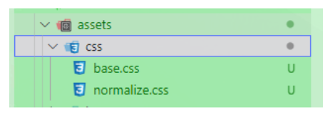
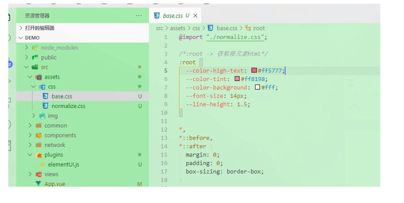
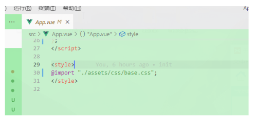

<!--
 * @Author: Tom
 * @LastEditors: Tom
 * @Date: 2022-09-07 22:34:38
 * @LastEditTime: 2022-09-07 22:37:10
 * @Email: Tom
 * @FilePath: \problem\docs\md\createProject\createProject.md
 * @Environment: Win 10
 * @Description:创建项目需要准备的
-->

## 创建项目准备

### css

- normalize.css
  1.  在项目中为什么使用 normalize.css
  - Normalize.css 是一个可以定制的 CSS 文件，它让不同的浏览器在渲染网页元素的时候形式更统一。
  - 保留有用的默认值，不同于许多 CSS 的重置，标准化的样式，适用范围广的元素。，纠正错误和常见的浏览器的不一致性。一些细微的改进，提高了易用性。使用详细的注释来解释代码。
  2. 配置
     - 把 normalize.css 拉到项目中
       - 
     - base.css 是咱自己要配置全局的样式
       - 
     - base.css
       - **../../assets/createProject/base.css**
     - normalize.css
       - **../../assets/createProject/normalize.css**
  3. 使用 怪载到 App.vue
     - 

### 编码风格

- .editorconfig（小老鼠）
  - vscode 右键生成.editorconfig
