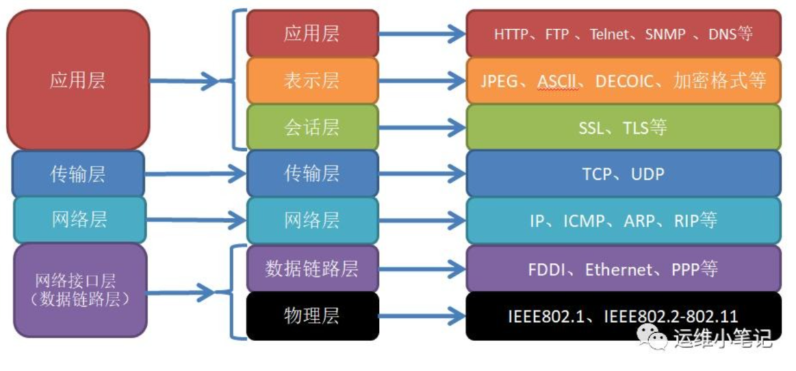
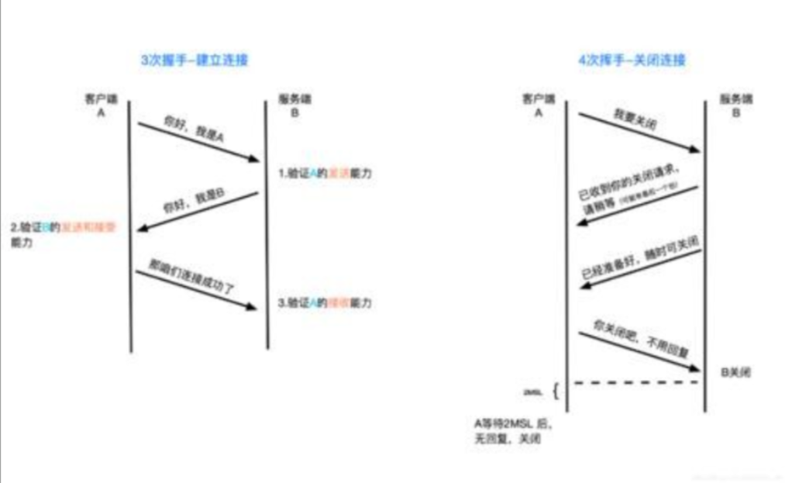
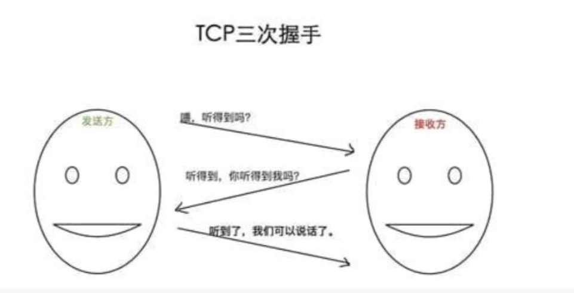

<!--
 * @Author: Tom
 * @LastEditors: Tom
 * @Date: 2022-09-07 15:32:57
 * @LastEditTime: 2022-09-07 16:20:37
 * @Email: Tom
 * @FilePath: \problem\docs\md\ms\liulanqi.md
 * @Environment: Win 10
 * @Description: 浏览器相关的面试题
-->

## 在地址栏里输入一个 URL,到这个页面呈现出来，中间会发生什么?

### DNS 域名解析（简述域名解析过程）

- 根据输入的 URL 域名找到真实 IP 地址，在查找的过程中，浏览器首先会寻找缓存，查看缓存中是否有记录，缓存的查找记录为
  - 浏览器缓存->操作系统缓存->路由器缓存
  - 缓存中没有则查找系统的 hosts 文件中是否有记录
  - 如果没有则查询 DNS 服务器，首先从顶级域名，再到二级域名，以此类推

### 浏览器与服务器建立连接

- TCP 连接 -->对应阶段：三次握手建立连接，数据传输，四次挥手断开连接

  - 什么是 TCP

    - TCP（Transmission Control Protocol，传输控制协议）是一种面向连接的、可靠的、基于字节流的传输层通信协议

  - TCP 连接

    - 

  - TCP 连接经历了下面三个阶段

    - 

    1. 建立连接
       - 通过三次握手(即总共发送 3 个数据包确认已经建立连接)建立客户端和服务器之间的连接
       - 
    2. 传输数据
       - 进行数据传输。这里有一个重要的机制，就是接收方接收到数据包后必须要向发送方确认, 如果发送方没有接到这个确认的消息，就判定为数据包丢失，并重新发送该数据包。当然，发送的过程中还有一个优化策略，就是把大的数据包拆成一个个小包，依次传输到接收方，接收方按照这个小包的顺序把它们组装成完整数据包
       - 连接后，客户端向服务端发起 HTTP 请求，服务器接收到请求后，返回请求静态资源，并同时调用 apache 服务器请求接口数据
    3. 关闭 TCP 连接
       - 数据传输完成，客户端与服务端进行四次挥手，关闭连接
       - 断开一个 TCP 连接则需要“四次挥手”
         1. 第一次挥手
            - 主动关闭方发送一个 FIN，用来关闭主动关闭方到被动关闭方的数据传送，也就是主动关闭方告诉被动关闭方，主动关闭方已经不会再给被动关闭方发送数据了（当然，在 FIN 包之前发送出去的数据，如果没有收到对应的 ACK 确认报文，主动关闭方依然会重发这些数据），但是，此时主动关闭方还可以接收数据
         2. 第二次挥手
            - 被动关闭方收到 FIN 包后，给对方发送一个 ACK，确认序号为收到序号+1（与 SYN 相同，一个 FIN 占用一个序号）
         3. 第三次挥手
            - 被动关闭方发送一个 FIN，用来关闭被动关闭方到主动关闭方的数据传送，也就是告诉主动关闭方，被动关闭方的数据也发送完了，不会再给主动关闭方发送数据了
         4. 第四次挥手
            - 主动关闭方收到 FIN 后，给被动关闭方发送一个 ACK，确认序号为收到序号+1，至此，完成四次握手。
       - 根据 IP 地址，客户端与服务端进行三次握手，建立连接。为了准确无误地把数据送达目标处，TCP 采用了三次握手策略：用 TCP 把数据包发送出去后，TCP 不会对传送后的数据置之不理，它一定会向对方确认是否成功送达
         1. 发送端首先给接收端发送一个带 SYN 标志的数据包
         2. 接收端收到后，回传一个带有 SYN/ACK 标志的数据包以表示正确传达，并确认信息
         3. 最后，发送端再回传一个带 ACK 标志的数据包，代表“握手”结束
       - **得到服务器的 ip 地址后，浏览器根据这个 ip 以及相应的端口号，构造一个 http 请 求，这个请求报文会包括这次请求的信息，主要是请求方法，请求说明和请求附带的数 据，并将这个 http 请求封装在一个 tcp 包中，这个 tcp 包会依次经过传输层，网络层， 数据链路层，物理层到达服务器，服务器解析这个请求来作出响应，返回相应的 html 给浏览器**

    - 总结
      - TCP 连接通过这几种手段来保证数据传输的可靠性
      - 一是三次握手确认连接
      - 二是数据包校验保证数据到达接收方
      - 三是通过四次挥手断开连接

  - **注意：Chrome 在同一个域名下要求同时最多只能有 6 个 TCP 连接，超过 6 个的话剩下的请求就得等待。假设现在不需要等待，我们进入了 TCP 连接的建立阶段。**

### web 浏览器发送 http 请求

- 浏览器发送 http 请求必须携带：请求行，请求头，请求体

### web 服务器处理请求并返回 http 响应

### 浏览器接收 http 响应

- 网络响应具有三个部分：响应行，响应头和响应体

### 浏览器渲染页面

- 对于浏览器根据服务端返回的静态资源，浏览器使用 Native GUI 引擎渲染 HTML 和 CSS ，使用 JS 引擎加载 JS
- **因为 html 是一个树形结构，浏览器根据这个 html 来构建 DOM 树，在 dom 树的构建过程中如果遇到 JS 脚本和外部 JS 连接，则会停止构建 DOM 树来执行和下载 相应的代码，这会造成阻塞，这就是为什么推荐 JS 代码应该放在 html 代码的后面**
- 内联样式构建一个 CSS 对象模型树 CSSOM 树，构建完成 后和 DOM 树合并为渲染树，这里主要做的是排除非视觉节点，比如 script，meta 标签和 排除 display 为 none 的节点，之后进行布局，布局主要是确定各个元素的位置和尺寸，之后是渲染页面，因为 html 文件中会含有图片，视频，音频等资源，在解析 DOM 的过 程中，遇到这些都会进行并行下载，浏览器对每个域的并行下载数量有一定的限制，一 般是 4-6 个，当然在这些所有的请求中我们还需要关注的就是缓存

1. 将 HTML 节点解析成 DOM 树结构
   - 在 DOM 树的构建过程中如果遇到 JS 脚本和外部 JS 连接，则会停止构建 DOM 树来执行和下载相应的代码，这会造成阻塞，这就是为什么推荐 JS 代码应该放在 html 代码的后面。
   - 从 HTML 字节码到 DOM 树结构的流程：字节(Bytes) =### 字符串(Characters) =### Tokens =### 节点(Nodes) =### DOM
   - 计算机只能识别 0 和 1 的字节，根据字节的编码规则将字节转换成字符串，再将字符串转化为 W3C 定义的各种标签，生成 tokens（令牌），匹配字符串，将 tokens 按照规则转换为包含属性和规则的节点对象（nodes）,根据每个节点的层次关系（父子节点关系）和规则转换为直观的树形结构。HTML 是增量构建的，在 HTML 文件还在传输时，这个转换过程就已经开始了。最终得到完整的 DOM(Document Object Module 文档对象模型)
2. 将 CSS 解析成 CSSOM 规则树
   - 这里主要做的是排除非视觉节点，比如 script，meta 标签和排除 display 为 none 的节点；有了 Render Tree，浏览器已经能知道网页中有哪些节点、各个节点的 CSS 定义以及他们的从属关系
   - CSS 构建的过程跟 DOM 差不多，只不过 CSS 会涉及到复杂的计算，如 CSS 的属性来源，匹配不同的类（id 或者 class）,确认复写规则及权重，最后确定每个节点的样式值，形成 CSSOM(CSS Object Module CSS 对象模型)。
3. 将 DOM 与 CSSOM 组合成 Render-tree（渲染树）
   - 布局：计算出每个节点在屏幕中的位置
   - 绘制：即遍历 render 树，并使用 UI 后端层绘制每个节点
4. 加载 JavaScript 脚本
   - 虽然 HTML、CSS 与 JS 是通过不同的引擎加载，但是却是互斥的，即加载 HTML、CSS 时，JS 会停止加载，相反亦然，这是因为 JS 引擎可以操作 DOM，改变样式、内容等。所以当执行了 JS 之后，渲染树要重新构建。
   - **缓存一般通过 Cache-Control、Last-Modify、Expires 等首部字段控制。 Cache-Control 和 Expires 的区别 在于 Cache-Control 使用相对时间，Expires 使用的是基于服务器 端的绝对时间，因为存 在时差问题，一般采用 Cache-Control，在请求这些有设置了缓存的数据时，会先 查看 是否过期，如果没有过期则直接使用本地缓存，过期则请求并在服务器校验文件是否修 改，如果上一次 响应设置了 ETag 值会在这次请求的时候作为 If-None-Match 的值交给 服务器校验，如果一致，继续校验 Last-Modified，没有设置 ETag 则直接验证 Last-Modified，再决定是否返回 304。**

### 连接结束
