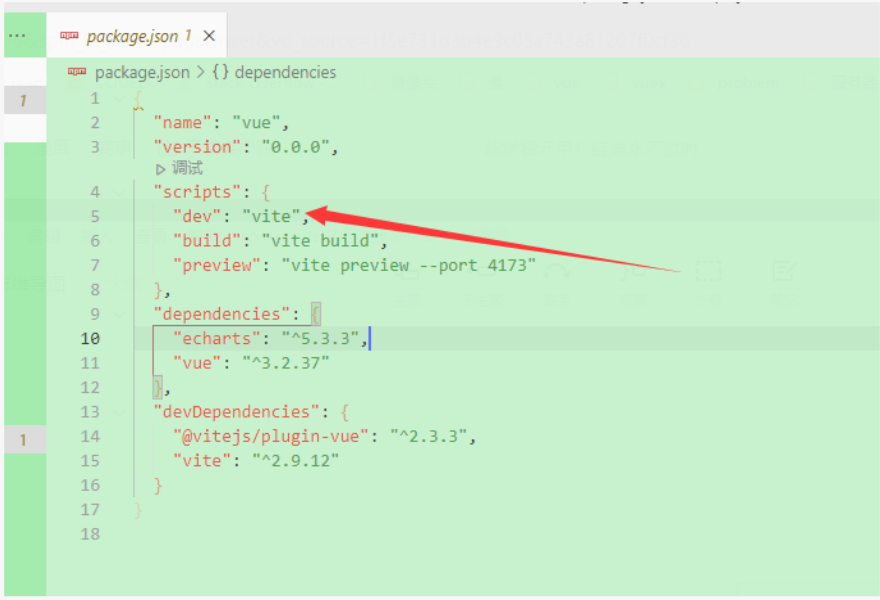
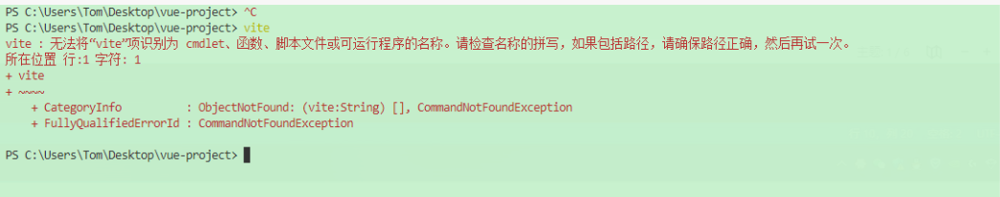
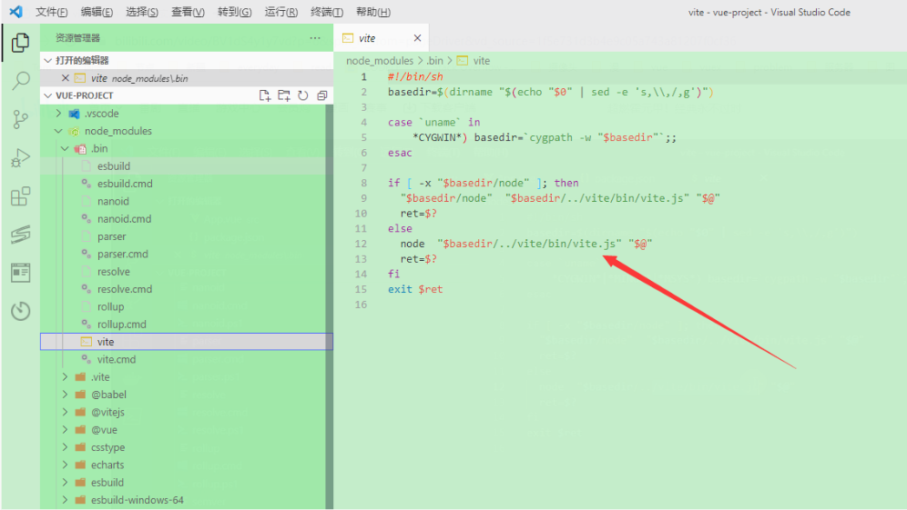
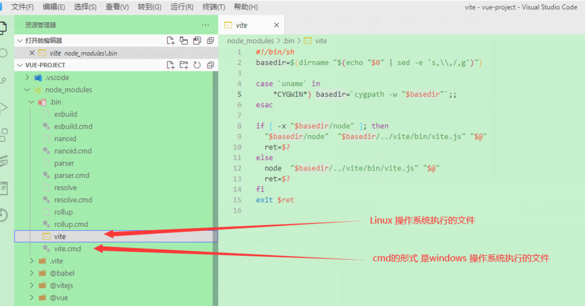
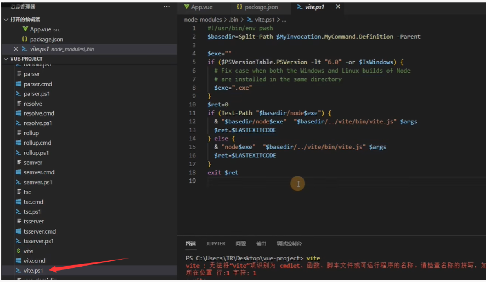

<!--
 * @Author: Tom
 * @LastEditors: Tom
 * @Date: 2022-09-07 16:30:55
 * @LastEditTime: 2022-09-07 16:50:59
 * @Email: Tom
 * @FilePath: \problem\docs\md\node\npm.md
 * @Environment: Win 10
 * @Description: pm run dev 执行过程
-->

## npm run dev 执行过程

### 我们执行这个命令的时候，会去找 package.json 的 scripts 然后执行相对应 dev 命令

- dev 其实是执行的 vite
- 

### 为什么不直接运行 viet 呢

- 因为我们电脑没有配置过相关命令
  所以无法执行
- 

### vite 是通过 软链接 的形式

1. 他会优先从 node_modules -> bin 下去找环境变量，如果没有的话 就会从全局找，全局就是 npm i -g 的安装目录
   - 
2. 为什么会有两个文件呢
   - 
3. 可能还有会一个 vite.ps1 文件
   - 跨平台使用的 可以在 windows 上用 也可以在 Linux 上用
   - 
