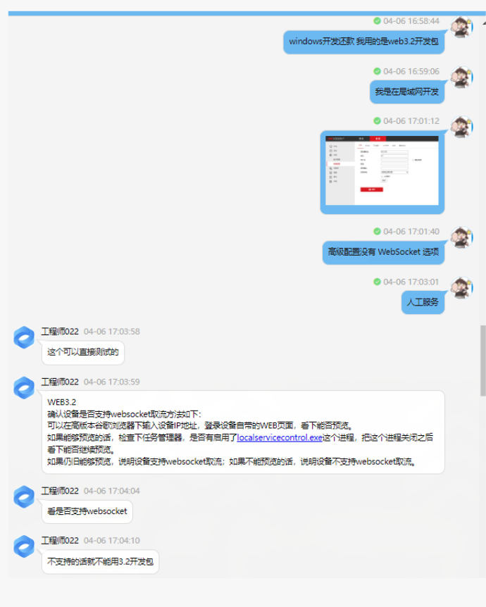
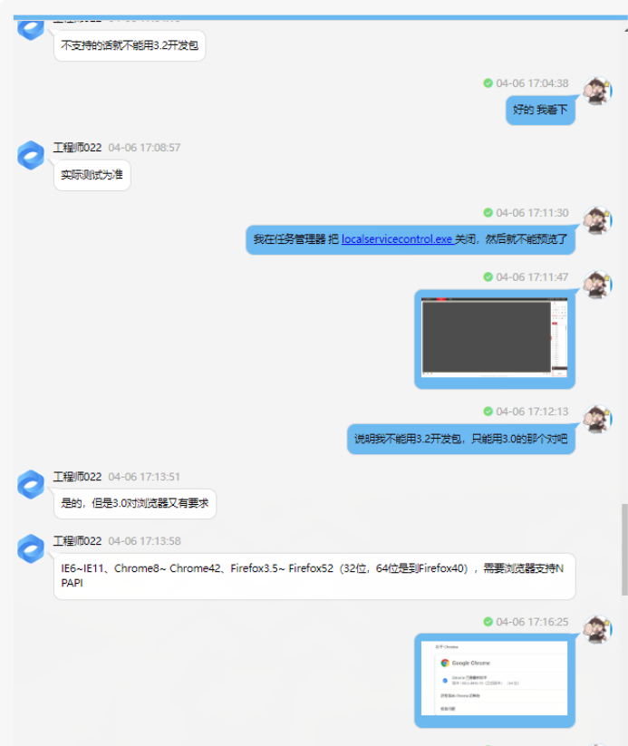
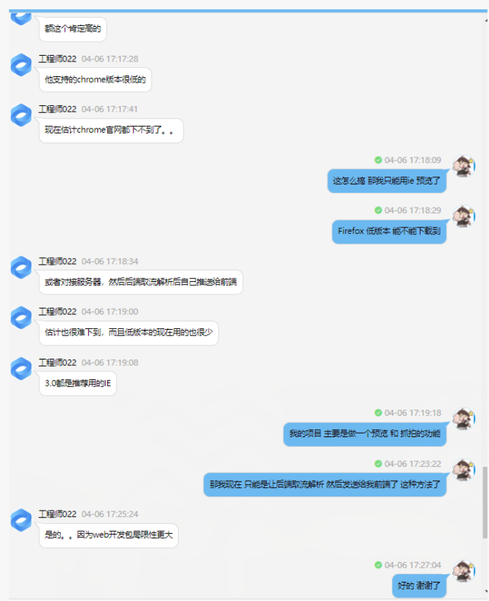

<!--
 * @Author: Tom
 * @LastEditors: Tom
 * @Date: 2022-09-08 11:31:32
 * @LastEditTime: 2022-09-08 11:36:43
 * @Email: Tom
 * @FilePath: \problem\docs\md\problem\haikang.md
 * @Environment: Win 10
 * @Description: 海康摄像头
-->

### 官网地址

- https://open.hikvision.com/#home
  - 账号密码
    - 18866960309
    - fengluo0911
- web 开发包地址
  - https://open.hikvision.com/download/5cda567cf47ae80dd41a54b3?type=10&id=4c945d18fa5f49638ce517ec32e24e24

### web3.0(有插件版)和 web3.2(无插件版)区别

- 客服聊天记录
  - 
  - 
  - 

### 安装包

- 百度网盘有链接
  - web3.0(无插件)
  - web3.2(有插件)

### 参考文档

- https://blog.csdn.net/qq_34010941/article/details/117807821
- https://blog.csdn.net/qq_35583089/article/details/80631069
- https://blog.csdn.net/concealed0/article/details/88637413
