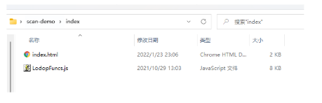

<!--
 * @Author: Tom
 * @LastEditors: Tom
 * @Date: 2022-09-08 12:30:10
 * @LastEditTime: 2022-09-08 12:49:28
 * @Email: Tom
 * @FilePath: \problem\docs\md\vue\vue2\barCode.md
 * @Environment: Win 10
 * @Description:Vue 中怎么打印标签条形码    打印机 -- 得力-888B
-->

## Vue 中怎么打印标签条形码

### 生成条形码

1. 安装 barcode

   - yarn add jsbarcode -D

2. 在使用的页面导入

   - ```js
     import JsBarcode from 'jsbarcode'
     ```

   - 

3. js 部分

   - ```js
     JsBarcode('#barcode', '12312312', {
       format: 'CODE128', //选择要使用的条形码类型
       width: 4, //设置条之间的宽度
       height: 80, //高度
       displayValue: true, //是否在条形码下方显示文字
       // text: "asd  2012101 血常规", //覆盖显示的文本
       // fontOptions: "", //使文字加粗体或变斜体
       font: 'fantasy', //设置文本的字体
       // textAlign: "left", //设置文本的水平对齐方式
       // textPosition: "top", //设置文本的垂直位置
       textMargin: 5, //设置条形码和文本之间的间距
       fontSize: 30, //设置文本的大小
       // background: "#eee", //设置条形码的背景
       lineColor: '#000', //设置条和文本的颜色。
       margin: 10, //设置条形码周围的空白边距
     })
     ```

   - 

4. html 部分

   - 

   - 这三个方式选择一个就行

   - ```js
     <svg id="barcode"></svg>
     <canvas id="canvas"></canvas>
     <div @click="printPreview(1)">打印</div>
     ```

### 使用 lodop 如何打印

- 去官网下载包

  - [地址](http://www.c-lodop.com/)
  - 

- 解压后

  - 
  - 选择 64 位安装，install_lodop64，以管理员身份运行
  - 需要安装云打印插件 : " CLodop_Setup_for_Win32NT.exe "
    - 

- 把 js 文件拉入到 demo 中

  - 
  - 文件目录
    - 

- demo

  - ```js
      <div class="content">
          <p>asdas</p>
        </div>
        <button class="btn">dianji</button>
        <script src="./LodopFuncs.js" type="text/javascript" language="javascript"></script>
        <script>
          document.querySelector(".btn").onclick = function () {
            var strHTML = document.querySelector(".content").innerHTML
            LODOP.PRINT_INITA(1, 1, 770, 660, "测试预览功能")
            LODOP.ADD_PRINT_TEXT(10, 60, 300, 200, "这是测试的纯文本，下面是超文本:")
            LODOP.ADD_PRINT_HTM(30, 5, "100%", "80%", strHTML)
            LODOP.PREVIEW()
          }
        </script>
    ```

  - 

  - 

- vue 中如何使用

  - 把安装包的 js 文件拉入项目中 引入
    - 
  - html 部分
    - 
  - js 部分
    - 

- 打印机设置

  - 首先先安装你对应打印机对应的驱动
  - 这次打印的是标签打印机 牌子: 得力-888B
    - 
    - 
    - 
    - 
  - 首先确定你的打印纸的大小
    - 这次是标签打印，打印纸是 长 50mm 宽 30mm
    - 控制面板 -> 硬件和声音 -> 设备和打印机: 选择你的打印机
      - 
    - 右键打印机 -> 选择打印机首选项
      - 
  - 添加完之后，在页面打印页面就可以看到你新建的大小了
    - 
  - 如果打印中 二维码显示不清晰的话 可以选择这个选项
    - 
    - 

- 打印时踩过的坑

  - 条形码加载显示问题 this.$nextTick
  - 别忘记 ref 属性，还有打印的样式要写到 style 标签里
    - 
  - 设置字体大小时，样式要慢慢搞 多注意
    - 
  - 打印机一次出好几张问题
    - 多试几次打印，打印机前几次打印可能会打印两张，因为打印纸要拉紧固定好
    - 如果还是打印很多张，就注意要 自己新建打印纸大小了 可以看上面如何新建
  - 参考文档
    - [lodop 使用教程](https://blog.csdn.net/Hello_World_QWP/article/details/78125642)
    - [vue 中如何生成条形码](https://www.cnblogs.com/langmohua/p/15078328.html)
