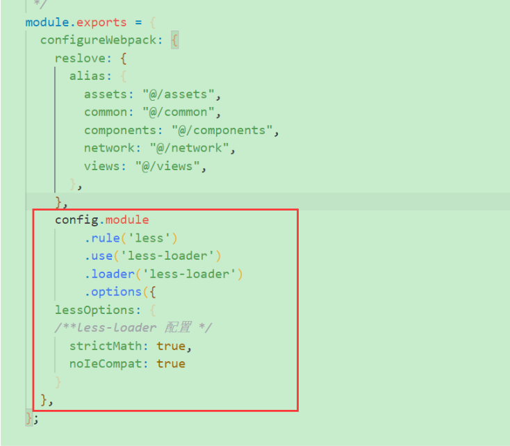
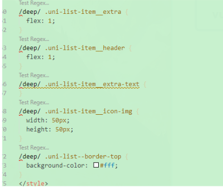

<!--
 * @Author: Tom
 * @LastEditors: Tom
 * @Date: 2022-09-08 11:40:39
 * @LastEditTime: 2022-09-08 11:41:28
 * @Email: Tom
 * @FilePath: \problem\docs\md\vue\vue2\css.md
 * @Environment: Win 10
 * @Description:
-->

## vue css 问题

### vue 中使用 less

1. 下载安装
   - 下载 less
     - yarn add less -D
   - 下载 less-loader
     - 下载这个版本：yarn add less-loader@7.3.0 -D
2. 然后在 vue.config 里配置
   - 
3. 注意
   - 比如在修改 elementui 或者 uni-app 里的样式的时候，是需要前面带/deep/ 进行穿透在编辑器里 <style scoped> 不加 lang='less' 的时候写是报错的
     但是不影响正常使用
   - 
