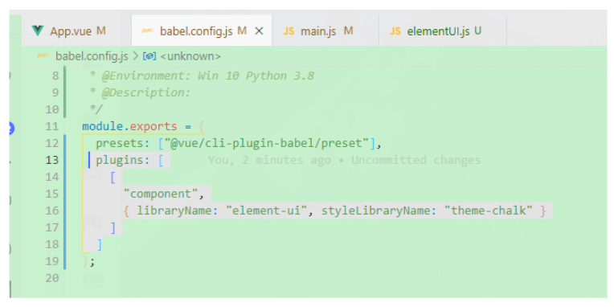
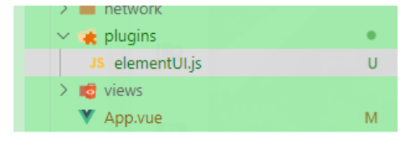
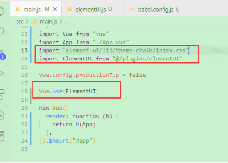

<!--
 * @Author: Tom
 * @LastEditors: Tom
 * @Date: 2022-09-08 11:42:20
 * @LastEditTime: 2022-09-08 12:03:21
 * @Email: Tom
 * @FilePath: \problem\docs\md\vue\vue2\elementUi.md
 * @Environment: Win 10
 * @Description:vue+elementUI 按需加载
-->

### 1.先下载

- yarn add element-ui -S

### 2.安装插件

- yarn add babel-plugin-component -D

### 3.在 babel.config.js 配置

- ```js
  plugins: [['component', { libraryName: 'element-ui', styleLibraryName: 'theme-chalk' }]]
  ```

- 

### 4.创建一个 js 文件

- 
- 配置

  - 文件地址

    - ../../../assets/vue/vue2/elementUI.js

### 5.挂载到 vue

- import "element-ui/lib/theme-chalk/index.css"
- 
