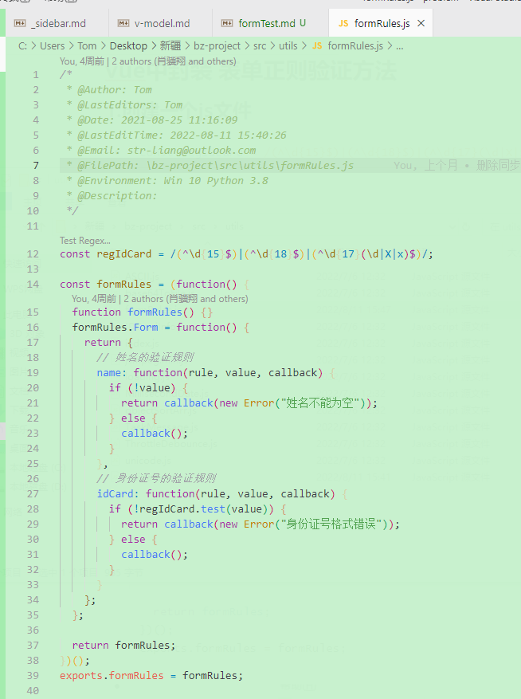
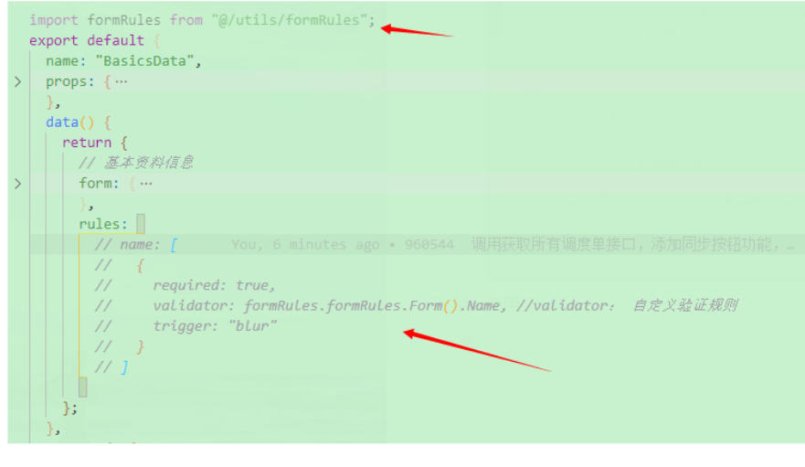

<!--
 * @Author: Tom
 * @LastEditors: Tom
 * @Date: 2022-09-08 12:14:05
 * @LastEditTime: 2022-09-08 12:17:49
 * @Email: Tom
 * @FilePath: \problem\docs\md\vue\vue2\formTest.md
 * @Environment: Win 10
 * @Description: 表单 正则 验证
-->

## vue 中封装 表单正则验证方法

### 1.创建一个 js 文件

- ```js
  const regIdCard = /(^\d{15}$)|(^\d{18}$)|(^\d{17}(\d|X|x)$)/

  const formRules = (function () {
    function formRules() {}
    formRules.Form = function () {
      return {
        // 姓名的验证规则
        name: function (rule, value, callback) {
          if (!value) {
            return callback(new Error('姓名不能为空'))
          } else {
            callback()
          }
        },
        // 身份证号的验证规则
        idCard: function (rule, value, callback) {
          if (!regIdCard.test(value)) {
            return callback(new Error('身份证号格式错误'))
          } else {
            callback()
          }
        },
      }
    }

    return formRules
  })()
  exports.formRules = formRules
  ```

- 

### 2.导入使用

- 

### 3.注意

- rules 里的 name，必须 form 里也存在 name
