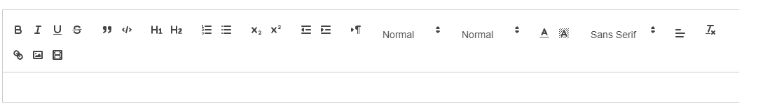
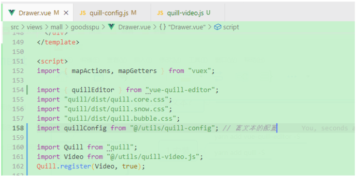
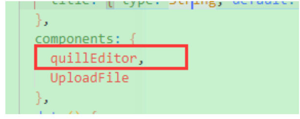
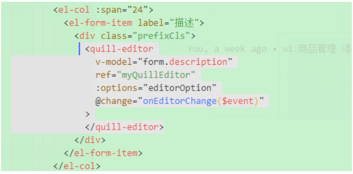
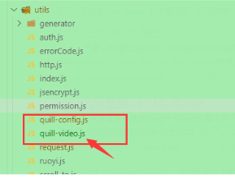
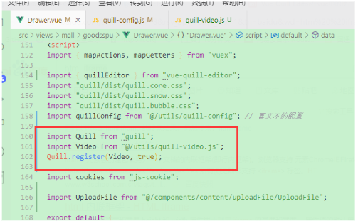

<!--
 * @Author: Tom
 * @LastEditors: Tom
 * @Date: 2022-09-08 12:20:02
 * @LastEditTime: 2022-09-08 12:26:30
 * @Email: Tom
 * @FilePath: \problem\docs\md\vue\vue2\richText.md
 * @Environment: Win 10
 * @Description:Vue 中如何使用富文本？
-->

## Vue 中如何使用富文本？

### 什么是富文本？

- 

### 1.安装

- yarn add vue-quill-editor -S
- yarn add quill -S

### 2.导入

- 在需要的.vue 文件里导入

  - ```js
    import { quillEditor } from 'vue-quill-editor'
    import 'quill/dist/quill.core.css'
    import 'quill/dist/quill.snow.css'
    import 'quill/dist/quill.bubble.css'
    import quillConfig from '@/utils/quill-config' // 富文本的配置

    import Quill from 'quill'
    import Video from '@/utils/quill-video.js'
    Quill.register(Video, true)
    ```

  - 

- 注册使用组件

  - 
  - 

### 3.配置

- data

  - ```js
    editor: null,
    editorOption: quillConfig
    ```

- mounted

  - ```js
    this.editor = this.$refs.myQuillEditor.quill
    ```

- 富文本的配置文件

  - 创建一个 js 文件，也就是刚才引入的 js 文件
  - import quillConfig from "@/utils/quill-config"; // 富文本的配置
  - quill-config.js
    - ../../../assets/vue/vue2/quill-config.js

### 4.问题

- 视频上传的时候 Quill 内部是用的 iframe 标签，传入视频格式的话 浏览器会自动下载，并且在小程序 是不支持 iframe 标签的
- 我们需要把 iframe 标签 转换成 video 标签
- 解决
  - 创建一个 js 文件，和富文本配置同目录就行
  - 
  - 引入
    - 
  - quill-video.js
    - ../../../assets/vue/vue2/quill-video.js
