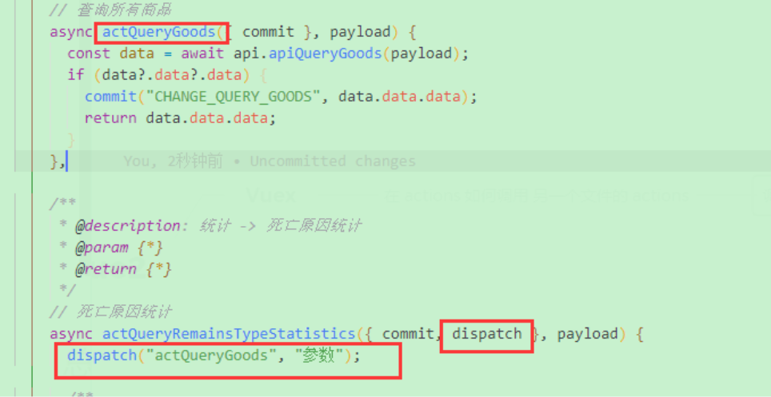
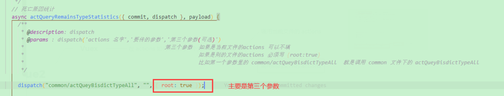

<!--
 * @Author: Tom
 * @LastEditors: Tom
 * @Date: 2022-09-07 18:03:03
 * @LastEditTime: 2022-09-07 18:12:53
 * @Email: Tom
 * @FilePath: \problem\docs\md\vue\vue2\vue2.md
 * @Environment: Win 10
 * @Description:
-->

## vuex

### 在 actions 如何调用 另一个文件的 actions

- 调用当前文件的 actions

  - 

- 调用别的文件的 actions

  - ```js
    /**
     * @description: dispatch
     * @params : dispatch('actions 名字','要传的参数','第三个参数(可选)')
     *                                              第三个参数  如果是当前文件的actions 可以不填
     *                                                         如果是别的文件的actions 必须写 {root:true}
     *                                                         比如第一个参数里的 common/actQueyBisdictTypeAll
     *                                                         就是调用 common 文件下的 actQueyBisdictTypeAll
     */
    ```

  - 
